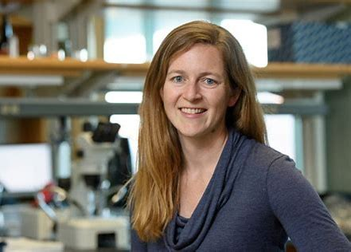

## **Kimberly Cardenas**

Kimberly Cardenas, from Richmond, California, is pursuing a bachelors degree in Human Biology at Stanford University. She believes scientific research is essential for change in social practices and healthcare policy. Growing up as a child of immigrants, translation and simplification of information has played a huge role in her life. She believes science communication can and should be made more accessible to people of different backgrounds. She is passionate about her role as a chief lab assistant at Arbor free clinic, where she interprets results to her patients in English and Spanish, and develops the training curriculum for new assistants. She also enjoys teaching and mentoring younger students as a Frosh 101 leader. For fun, she enjoys backpacking unfamiliar terrains and is training to become a SPOT leader. She is a proud HSF and QuestBridge Scholar.

## **Mallory Harris**

Mallory Harris is a PhD candidate in Biology (Ecology and Evolution track) at Stanford University. She earned dual bachelor's degrees in Applied Mathematics and Computational Biology from the University of Georgia. Mallory uses quantitative methods to study the interplay between human behavior and infectious diseases: how human activity can impact epidemic dynamics and how people respond to outbreaks. She also works to improve personal and collective responses to infectious diseases by communicating science and counteracting health misinformation.

## **Erin Mordecai, PhD**

Erin Mordecai is an Associate Professor of Biology and Senior Fellow at the Woods Institute for the Environment. She recieved her B.S. at the University of Georgia, with Honors Interdisciplinary Studies in Mathematical Biology. Her PhD at the University of California Santa Barbara in Ecology, Evolution, and Marine Biology. Her research focuses on how climate, species interactions, and global change drive infectious disease dynamics in humans and natural ecosystems. Her research combines mathematical modeling and empirical work. After her PhD in 2012 at the University of California Santa Barbara, she completed a 2-year NSF postdoctoral research fellowship in the Intersection of Biology and Mathematical and Physical Sciences and Engineering at the University of North Carolina at Chapel Hill and North Carolina State University. She has been at Stanford since January 2015.

## **Funding**

KJC was supported by the Biology Summer Undergraduate Research Program (B-SURP) at Stanford and The Stanford King Center on Global Development. MJH was supported by the Knight-Hennessy Scholars Program and the Achievement Rewards for College Scientists (ARCS) Scholarship. EAM was supported by the National Science Foundation (DEB-2011147), with support from the Fogarty International Center, the National Institute of General Medical Sciences (R35GM133439), the National Institute of Allergy and Infectious Diseases (R01AI168097 and R01AI102918), the Terman Award, and seed grants from the Stanford King Center on Global Health, Woods Institute for the Environment, and Center for Innovation in Global Development.
