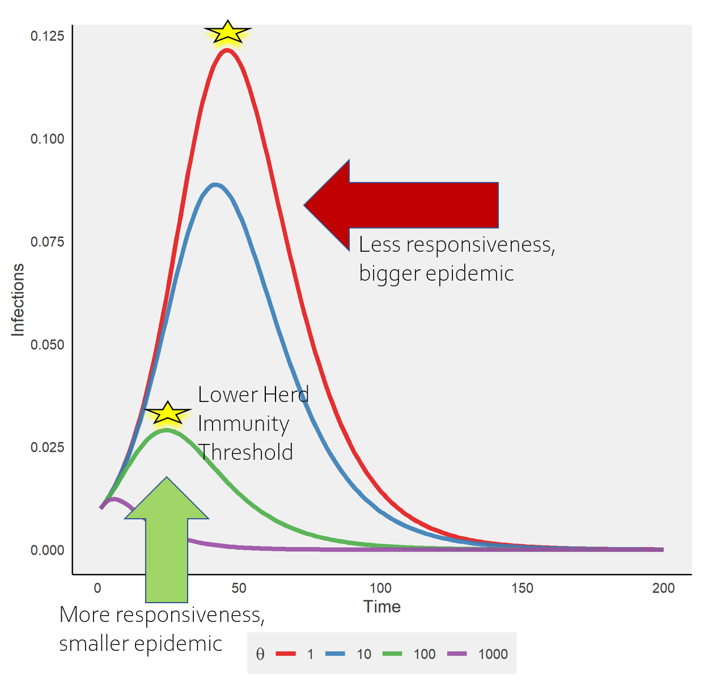

```{r setup, include=FALSE}
knitr::opts_chunk$set(echo = TRUE)
library(ggthemes)
```

# What is awareness-based protective behavior?

During an epidemic, people may decide whether to adopt protective behavior depending on how serious they think the disease is. They may try to estimate their own risk by looking at how many people are dying of the disease. We call this awareness-based protective behavior. Now, people can go from unprotective to protective at a rate that's proportional to recent deaths, reflecting their awareness of these severe disease outcomes. Unlike in the previous model that just included protective behavior, the uptake of protective behavior can change over time.

Awareness is scaled by responsiveness ($\theta$), a measure of how many people will change their behavior based on a single death. The figure below shows different levels of responsiveness when there's awareness-based adoption of a highly effective protective measures ($\kappa$) in a population that start out with no protective behavior ($P_0$). In this case, they consider deaths in the previous day when deciding whether to adopt protective behavior. Greater responsiveness means that more people will adopt protective behavior. How does responsiveness change epidemic shape and size?

```{r theta, echo = FALSE, message = FALSE, warning = FALSE, dpi=300}
library(plyr)
library(gridExtra)
library(grid)
library(patchwork)
library(tidyverse)
library(deSolve)


SIR_w_pbandawareness_run <- function(b=.2,r=.1,I0=.01, P0= 0, k=0.3, m=.01, time=200, theta=10, phi=0, ell=1){
   model <- function (time, init, parms) {
     with(as.list(c(init, parms)), {
      if(time<(ell+1)){
        lag<-rep(0, 8)
        }
        else{
        lag<-lagvalue(time-ell)
        }
      
       dSU <- -b*SU*(IU+k*IP)-theta*SU*(DU+DP-lag[7]-lag[8])+phi*SP
       dSP <- -b*k*SP*(IU+k*IP)+theta*SU*(DU+DP-lag[7]-lag[8])-phi*SP
       dIU <- b*SU*(IU+k*IP)-(r+m)*IU-theta*IU*(DU+DP-lag[7]-lag[8])+phi*IP
       dIP <- b*k*SP*(IU+k*IP)-(r+m)*IP+theta*IU*(DU+DP-lag[7]-lag[8])-phi*IP
       dRU <- r*IU-theta*RU*(DU+DP-lag[7]-lag[8])+phi*RP
       dRP <- r*IP+theta*RU*(DU+DP-lag[7]-lag[8])-phi*RP
       dDU <- m*IU
       dDP <- m*IP
       list(c(dSU, dSP, dIU, dIP, dRU, dRP, dDU, dDP))
     })
   }
   init<-c(SU=(1-P0)*(1-I0), SP=P0*(1-I0), IU=(1-P0)*I0, IP=P0*I0, RU=0, RP=0, DU=0, DP=0)
   parms <- c(b=b, r=r, k=k, m=m, theta=theta, phi=phi, ell=ell)
   time <- seq(1, time, 1)
   sir_df <- dede(init, time, model,parms)
   return(data.frame(sir_df))
}


theta<-c(1, 10, 100, 1000)

lapply(theta, function(x) SIR_w_pbandawareness_run(theta=x) %>% cbind(theta=x)) %>%
  do.call(rbind, .) -> sim_df

ggplot() +
    geom_line(data = sim_df, size = 1.5, alpha =0.9, aes(color=as.factor(theta), group=theta, x = time, y = IU+IP))+
    # geom_line(data = data.frame(outbreak), size = 1.5, alpha =0.9, aes(x = time, y = S,  col="Blue"))+
    labs(title = "",
         x="Time",
         y="Infections")+
    theme_fivethirtyeight()+
    theme(axis.line = element_line(color='black'),
          plot.background = element_blank(),
          panel.grid.major = element_blank(),
          panel.grid.minor = element_blank(),
          panel.border = element_blank(), 
          axis.title = element_text())+
        scale_color_brewer(palette="Set1", name=expression(theta))


```



Epidemics may span several months or years, so we also consider how awareness-based behavior may change over time with memory and fatigue. Memory ($\ell$) indicates how far into the past people look when evaluating disease risk. For example, if $\ell$ is thirty, people are considering all of the deaths that happened over the past months. People may not maintain protection forever because of waning immunity or difficult in continuing to practice potentially disruptive measures. Fatigue ($\phi$) indicates how quickly people lose protective behavior and become unprotective again. When $\phi=0$, protective behavior uptake never declines. Greater values of $\phi$ mean that people go from protective to unprotective more quickly.

In the figure below, we show infection prevalence [left] and protective behavior prevalence [right] over time. We set responsiveness ($\theta$) to 100. Each color is a different level of fatigue ($\phi$) and each row from top to bottom is longer memory ($\theta$). Fatigue can cause additional peaks depending on memory. How do the number, size, and shape of epidemic waves depend on both memory and fatigue?

```{r ell-phi, echo = FALSE, message = FALSE, warning = FALSE, dpi=300}


library(plyr)
library(gridExtra)
library(grid)
library(patchwork)

phi<-c(0, .01, .1 )
theta<-c(100)
ell<-c(10, 30, 90)


expand.grid(phi, theta, ell) %>%
          data.frame() %>%
          mutate(phi=Var1, theta=Var2, ell=Var3) %>%
          apply(1, function(x) SIR_w_pbandawareness_run(phi=x[["phi"]], theta=x[["theta"]], ell=x[["ell"]], time=1000) %>% cbind(phi=x[["phi"]], theta=x[["theta"]], ell=paste0('\u2113', " = ", x[["ell"]]))) %>%  do.call(rbind, .) -> sim_df

p1<-ggplot(filter(sim_df))+geom_line(aes(x=time, y=IU+IP, group=phi, colour=as.factor(phi)), size=1, alpha=.7)+facet_wrap(~ell, nrow=3)+theme(legend.position = "none")+ylab("Infections")+ylab("Protective Attitude")+labs(colour="phi")+
    theme_fivethirtyeight()+
    theme(axis.line = element_line(color='black'),
          plot.background = element_blank(),
          panel.grid.major = element_blank(),
          panel.grid.minor = element_blank(),
          panel.border = element_blank(), 
          axis.title = element_text())+
        scale_color_brewer(palette="Set1", name=expression(phi))+
  scale_y_continuous()+
  theme(legend.position="bottom")

p2<-ggplot(filter(sim_df))+geom_line(aes(x=time, y=SP+IP+RP, group=phi, colour=as.factor(phi)), size=1, alpha=.7)+facet_wrap(~ell, nrow=3)+ylab("Protective Attitude")+labs(colour="phi")+
    theme(legend.position="bottom")+
    theme_fivethirtyeight()+
    theme(axis.line = element_line(color='black'),
          plot.background = element_blank(),
          panel.grid.major = element_blank(),
          panel.grid.minor = element_blank(),
          panel.border = element_blank(), 
          axis.title = element_text())+
        scale_color_brewer(palette="Set1", name=expression(phi))

p1 + p2 + plot_layout(ncol=2, guides="collect") &
  theme(legend.position='bottom')

```

Attitudes toward the protective behavior may also be influenced by the way public health officials and the media cover the disease, including: global and local infection and death counts online, press briefing by government officials, personal anecdotes on social media platforms, and misinformation. How might these factors change behavior and epidemic dynamics? In the next section, we will look at the role that social divisions may play in shaping how members of different groups respond to and are affected by infectious diseases.


```{r z0, echo = FALSE, message = FALSE, warning = FALSE, dpi=300 }


library(jsonlite)
#install.packages('vembedr')
library(vembedr)

embed_url('https://www.youtube.com/watch?v=V48c_blQyKI')


```
