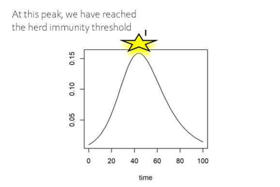
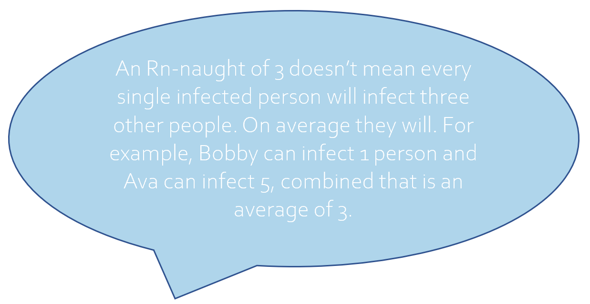

---
output:
  html_document:
    mathjax: "http://cdn.mathjax.org/mathjax/latest/MathJax.js?config=TeX-AMS-MML_HTMLorMML"
---

# What is an SIR Model?

A common tool to understand how infectious diseases spread is the Susceptible-Infected-Recovered-Deceased (SIRD) model. We divide the population into three categories corresponding to whether they have been infected and keep track of the proportion of the population in each category over time.

A *susceptible* individual is someone who has not gotten sick yet, and may become infected. When a new pathogen is introduced, the entire population starts out as susceptible.

An *infected* person has contracted the pathogen, and can spread it to other individuals. New infections happen when a susceptible person comes into contact with an infected person and successfully transmits the pathogen. The rate of new infections depends on the *transmission coefficient* ($\beta$), and more infectious diseases will have a great transmission coefficient. People may be able to transmit the pathogen for several days, corresponding to the *infectious period* ($\frac{1}{\rho}$). A larger infectious period means that people are infectious for a longer time.

At the end of the *infectious period*, people may recover. Our basic model assumes that *recovered* people are immune and can no longer become infected. Some people may die instead of recovering from the disease and we keep track of deaths with the *deceased* category. The *fatality probability* ($\mu$) gives the likelihood of dying of the disease, and more deadly diseases will have a greater fatality probability. You'll notice that this is not going to have a large impact on epidemic dynamics in this example. It will become important when we add awareness to the model, because awareness respond to death.

We can translate these assumptions into a system of equations and then use simulations to predict how epidemics may unfold under different disease properties. Below, we graph the results of a single simulation where we set $\beta=0.2$, $\rho=0.1$, $\mu=0.05$. The graphs below show the proportion of the population in each category over time. The proportion of people who are susceptible decreases as people become infected. Infections increase up to a peak, and then decline. Over time, more people recover or die of the disease. The proportion of the population in these categories levels off as infections decline due to herd immunity.

```{r outbreak, echo = FALSE, message = FALSE, warning = FALSE, dpi=300}
library(ggthemes)
library(magrittr)
library(dplyr)
library(deSolve)
library(ggplot2)
library(extrafont)


model <- function (time, init, parms) {
  with(as.list(c(init, parms)), {
    dS <- -b*S*I
    dI <-  b*S*I-r*I
    dR <- r*(1-m)*I
    dD <- r*m*I
    list(c(dS, dI, dR, dD))
  })
}
     
init <- c(S=.99, I=.01, R=0.0, D=0)
parms <- c(b=.2, r=.1, m=.01)
time <- seq(0, 100, 1)
outbreak <- ode(init, time, model, parms)
plot(outbreak, ymin=0)
```

## Herd immunity

In order to spread the disease, the pathogen needs susceptible people to come into contact with infectious people. As we showed above, there are fewer remaining susceptible people in the population over time. The herd immunity threshold is the point where enough people have become immune that the epidemic begins to slow down. In this case, the herd immunity threshold is reached when infections peak, after about 50% of people have been infected. Before then, each infected person infected greater than one person so infections increased. After the peak, fewer people will become infected each day than the day prior. There can still be new infections after the threshold is reached. The amount of infections after the peak is not universal, and varies with different parameters. The herd immunity threshold and other features of the epidemic (including its size and duration) depend on the disease's transmissibility.



## What is $R_0$

$R_0$, also known as R-naught is the basic reproduction number, which can help us predict how an epidemic will unfold. The value is a function of both transmission rate and duration, and the amount of people who are susceptible. From it, we can determine the average number of cases an infected individual will produce in a population where everyone is susceptible, helping us predict the trajectory of the disease. In our basic model above, $R_0=\frac{\beta}{\rho}$. This means that the disease will spread more quickly if it has a greater transmission coefficient ($\beta$) or if people are infectious for a longer period of time ($\frac{1}{\rho}$).

$R_0>1$ predicts an epidemic. $R_0<1$ predicts that the disease will die out without being able to sustain an epidemic. When $R_0=1$ and there are no interventions, it predicts stable sustained transmission of the pathogen. A hypothetical disease with an $R_0$ of about 10, one infected individual in a classroom could on average infect 10 classmates if nobody is already vaccinated or immune. A hypothetical disease with an $R_0$ of 0.3 to 0.8 would be less likely to cause an epidemic, eventually the disease will die off. It is harder to calculate the $R_0$ early on in an outbreak of a novel disease due to data limitations, but calculating this quantity can help us prepare for an epidemic. Using our interactive simulation tool, you can examine the relationship between $R_0$ and epidemic metrics like cumulative infection incidence, peak infection prevalence, and the date of peak infections. In our next model, we will examine how protective measures can change and help suppress epidemics.


