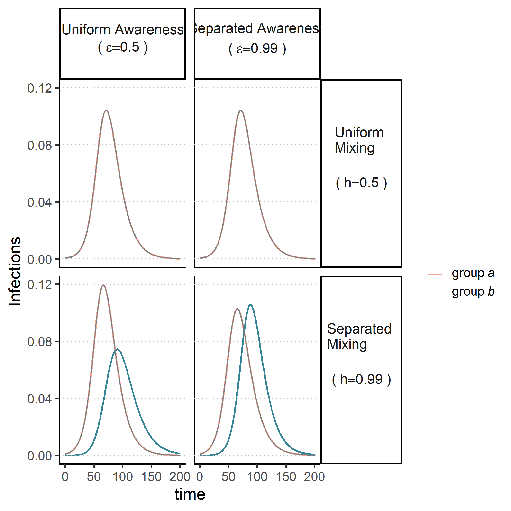

# How do population divisions affect epidemics?

The previous models all assumed that everyone faces the same risk of infection and reacts the same way. In reality, there may be big differences in disease risk and protective behavior uptake within a population. These differences could follow existing divides in the population, including age, socioeconomic status, race/ethnicity, political partisanship. For our final model, we separate the population into two groups (group *a* and group *b*), and assume half of the population is in each group. People cannot change their group over the course of the simulation. For this example, the difference between the two groups is that the infectious disease starts out in group *a* only.

Next, we look at potential divisions between the groups. Mixing separation (*h*) says how many of a person's contact will be in their own group versus the opposite group. Under uniform mixing ($h=0.5$), the groups are interacting with each other equally. Any contact is equally likely to be with someone in the same group as with someone in the opposite group. Greater values of *h* mean that there's more mixing separation, so a member of one group will rarely come into contact with the other group. If *h* is one, then the groups are totally isolated from each other. We'll look separated mixing ($h=0.99$) here, where contacts are almost entirely within one's own group but there's a small amount of interaction between the groups. This means that the disease can spread between the two groups. 

On top of that, we also introduce awareness separation ($\epsilon$) where people may be more likely to use protective measures if they hear about deaths in their own group compared to the opposite group. With uniform awareness ($\epsilon=0.5$), people pick up protective behavior without considering whether the deaths are in their own group or not. With separated awareness ($\epsilon=0.99$), people have a lot of awareness of deaths in their own group but place little weight on deaths in the opposite group. If $\epsilon$ reached one, that would mean members of one group do not consider deaths in the opposite group at all when deciding whether to use protective behavior.

In the figure below, we look at infections over time in group *a* (pink) and group *b* (green) across different combinations of awareness and mixing separation. When mixing is uniform, there is no difference between the groups because the infectious disease spreads quickly from group *a* into group *b*. When mixing is separated, the groups experience different epidemic trajectories because it takes a bit of time before the infectious disease begins to spread in group *b*. If mixing is separated, awareness separation can change the epidemic shape in both groups. In this case, uniform mixing leads to a smaller epidemic in group *b* because the group receives an early warning of the upcoming epidemic by seeing initial deaths in group *a*. Group *b* therefore has time to adopt protective behavior before the infectious disease starts spreading. The opposite happens in group *a* under uniform awareness; group *a* will underestimate its initial risk and have a larger epidemic. With separated awareness, group *b* does not respond much to the early deaths in group *a* and loses the early warning. Meanwhile, group *a* pays more attention to the initial deaths within its group and pick up protective behavior at the beginning of the epidemic. Separated awareness causes the two groups to have epidemics that are the same size.

What happens if mixing separation (*h*) is at some intermediate values between 0.5 and 0.99? What about awareness separation ($\epsilon$)? How does the different in epidemic size between the two groups under uniform awareness and separated mixing change depending on other values related to the disease, protective behavior, or awareness?

