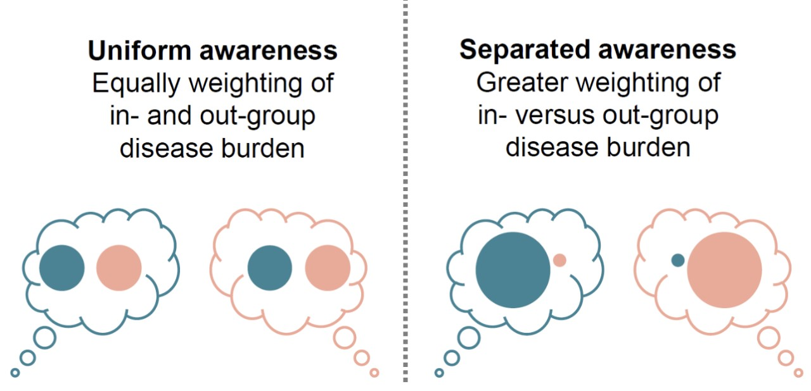

## Overview

The site consists of 4 "Explainer" tabs and 4 "Interactive App" tabs. You can click on any "Explainer" tabs to learn the models and variables and see some example graphs. You can click on any "Interactive App" tab to manipulate the variables and see simulation outcomes. The interactive apps will also give you numerical values for different epidemic metrics like cumulative infection incidence and peak infection prevalence.

## Models

The site consists of four models that build on each other in terms of complexity:

 We start with a basic disease model then ask what happens when people adopt protective behaviors? Protective behaviors are things like masks and social distancing. The models here are meant to represent non-pharmaceutical interventions, for vaccination and pharmaceutical interventions see the [full manuscript](https://www.cambridge.org/core/journals/evolutionary-human-sciences/article/social-divisions-and-risk-perception-can-drive-divergent-epidemic-dynamics-and-large-second-and-third-waves/71613CAF7D03C9F20A8864A59B9BF311#article). The awareness based model assumes people will get sick by the pathogen and in return, people asses their own risk which affects what protective measures they take.  Then we look at groups and social divisions. What happens when you have two groups and people care more about the deaths within their group? 

