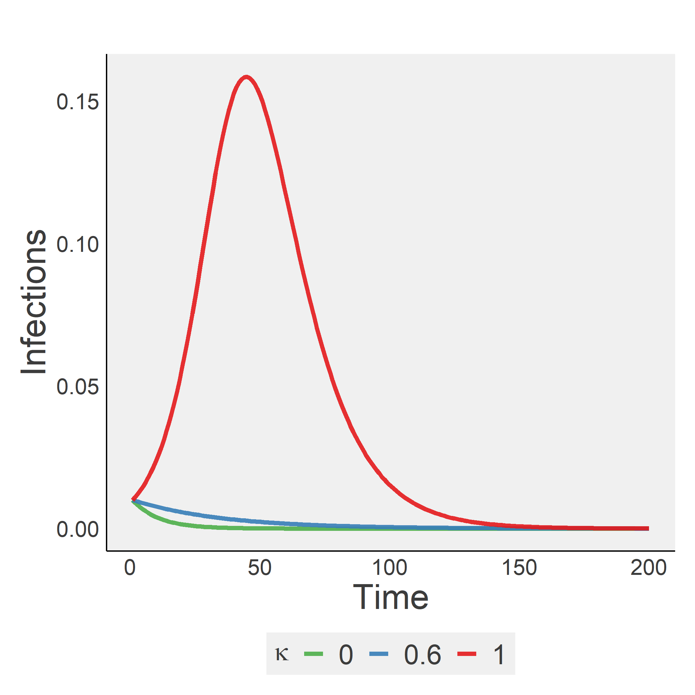
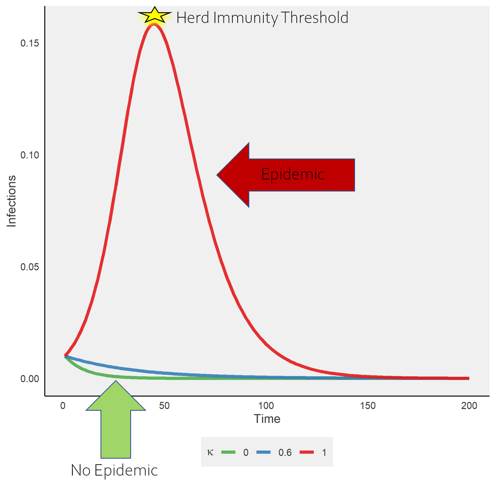
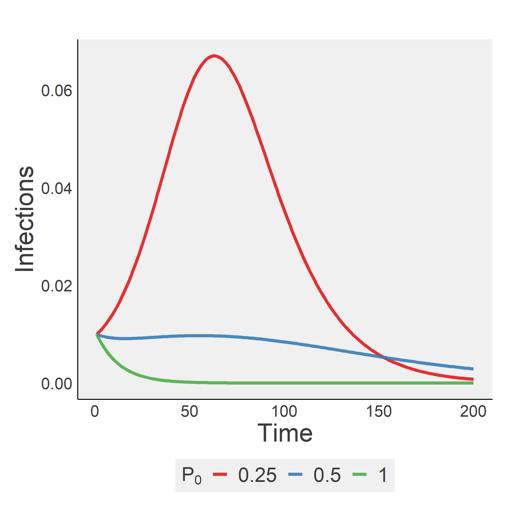

---
output:
  html_document:
    mathjax: "http://cdn.mathjax.org/mathjax/latest/MathJax.js?config=TeX-AMS-MML_HTMLorMML"
runtime: shiny
---

# What is protective behavior?

Protective behaviors are things such as vaccination, mask-wearing, hand washing, and social distancing. These are behaviors can help prevent the spread of infectious diseases. We primarily focus on protective rates that lowers the transmission rate, and not protective behaviors that shift people into the recovered category such as vaccination. Our model looks at both the efficacy and uptake of these behaviors.

Protective behavior efficacy ($\kappa$) scales the transmission term and may range between perfect protection ($\kappa=0$) and no impact on transmission ($\kappa=1$). In our model, protective behaviors prevent susceptible people from becoming infected and prevent infected people from spreading the pathogen. Thus, protective behaviors can have a squared effect on reducing transmission. 

In the following figure, we simulate an epidemic of the same disease from the explainer about the basic model. Everyone adopts protective behavior. We compare perfect protection efficacy ($\kappa=0$), intermediate protection efficacy ($\kappa=0.6$), and the baseline epidemic where protective measures have no effect ($\kappa=1$). Notice that when ($\kappa=0$), there is no transmission at all and the people who were initially infected recover over time. How do protective measures change the shape and size of the infection trajectory? How do they effect when the herd immunity threshold is reached? Under what conditions is there an epidemic? 

We also consider protective behavior uptake ($P_0$), which is the proportion of the population participating in the protective behaviors. For example, if $P_0=1$ then that means 100% of the population wash their hands properly. But if $P_0=0.25$ then only about a quarter of the population wash their hands properly and the disease will spread more widely. This model assumes that people are either protective or unprotective and that they cannot change their behavior over time, which may not be realistic for most protective measures. In the next model, we will consider what happens if people can change their behavior.

In the figure below, we look at what happens if 25%, 50%, or 100% of the population adopts a highly effective protective measure ($\kappa=0.3$). How does protective behavior uptake ($P_0$) affect the epidemic shape and size? Can you find different combinations of values for $P_0$ and $\kappa$ that produce similar epidemic dynamics? What is the relationship between protective measure efficacy and uptake?

